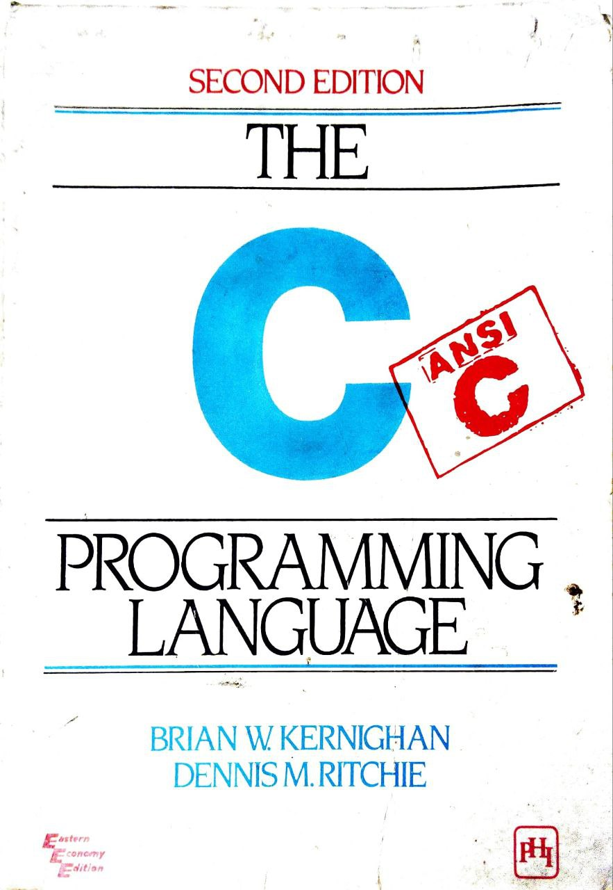

# C Projects

Managed entirely (for the first time) by git!<br/>
### Following the great book by the Masters:<br/>


## Topics covered:
- [x] Printing to stdout
- [x] Basic arithmatic operations
- [x] Variables
- [x] While loop
- [x] For loop
- [x] Symbolic Constants
- [x] Character I/O 
- [ ] Array

## Notes
```c
while (i< j)
    i = 2 * i
/* Can be without braces if it is a single statement */ 
/* needs to be indented */
```
```c
printf("%3d", 1);
/*       ^ 3 blank spaces and 1 is to the very right*/
printf("%6d", 1);
/*       ^ 3 blank spaces + 3 padding blank spaces = 6 blank spaces*/
printf("%6.3", 1);
/*       ^^^ 3 blank spaces + 3 padding spaces + .3 means 1 -> 001*/
printf("%*.*d", 3,2,1);
```
```
"C" ≠ 'C'
"C" returns a string
'C' returns the ASCII character code of C
```
```c
// Macros

#define dprint(expr) printf(#expr " %g\n", expr)

dprint(3/2);

// when dprint is called

printf("3/2" " (evaluated expr)", expr);
printf("3/2 (evaluated expr)", expr);
```
